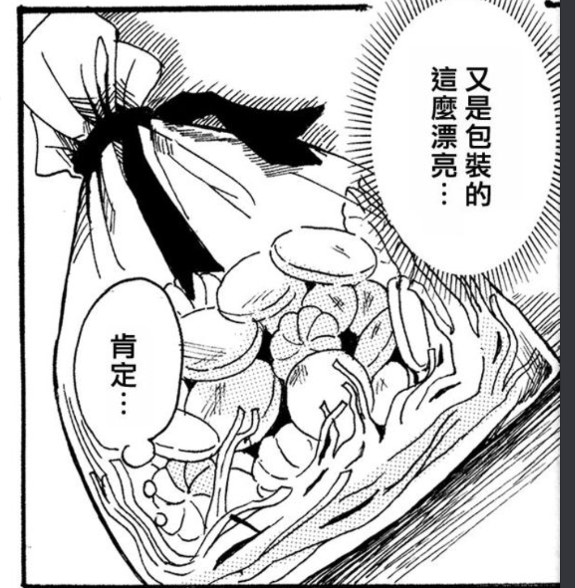
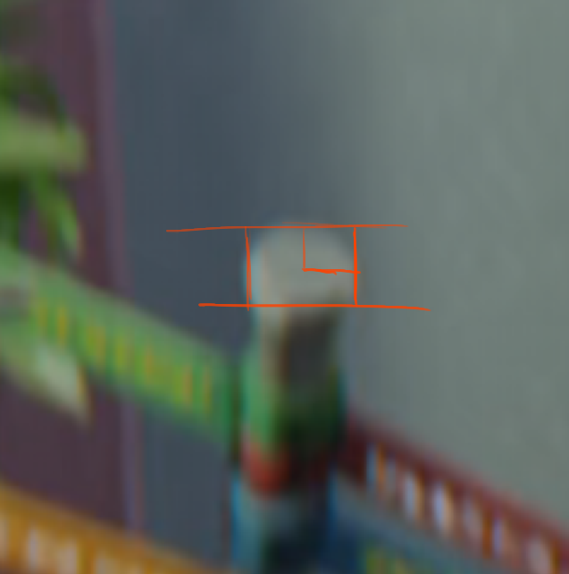
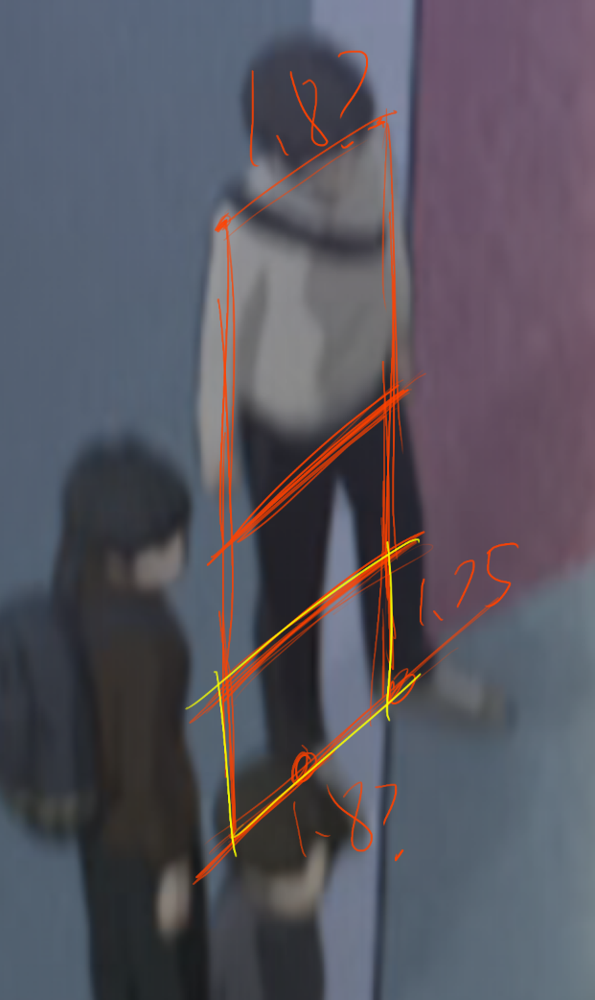
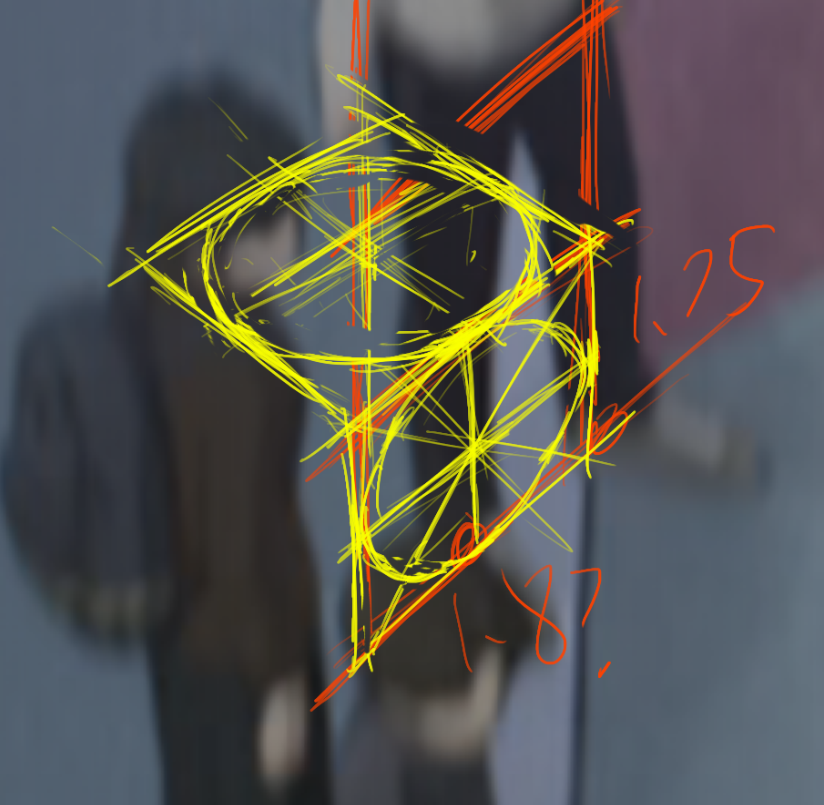

- 这个图谱拿来做日记，主要是记吐槽，画画。不记敏感的东西。
- 创建一些Tag，#实验 #点子 #注意到 #练习方式 #吐槽
- #练习方式 像这样的袋装饼干，用来作为快乐的椭圆绘制练习
  collapsed:: true
	- 
- #实验 判断这张长焦镜头的拍摄角度
  collapsed:: true
	- 
	- 实际拉透视线才发现，这个角度是45度（所以左边椰子树下面的草地，它其实是长方形的！不过其实从它长大于宽就能意识到这一点）。
	- 关于这张图的角度的判断方式：
		- 拉透视线，找上下的消失点（两点透视），假设画面未做裁切（这种镜头按理说不会莫名其妙做裁切，做和不做观感没啥差异）因此心点是画面中心，然后就能得到45度视圈，得到消失点对应旋转角度了；这里拉线看到两个消失点距离是一样的，因此是45度，消失点即距点，超长焦镜头，类似从直升机上拍摄
		  logseq.order-list-type:: number
		- 找透视圆，判断短长轴比例，如右下角的柱子的顶部，这里太糊了所以不太好判断；这里因为是大透视所以直接拉一个矩形去找比例，发现可以说是接近7：10的，因此是45度。
		  logseq.order-list-type:: number
			- 
			  logseq.order-list-type:: number
		- 按人的比例找（这个可能是最顶用的，但相当模糊），将人体正面看作一个矩形，尝试在这个矩形中找到正方形。
		  logseq.order-list-type:: number
			- （这个方法……很奇怪，**重点其实是法线方向**，找正方形甚至都是无所谓的）
			  logseq.order-list-type:: number
			- 一个一般人体的比例的话，以头的高度为衡量标准，高为7，宽为1.3-1.8左右（以鲁米斯头部为基准，头部的宽为 $\frac{3}{4}$，然后肩宽……随便假设为为1.8-2.5头，因此就得到1.3-1.8这个笔触）
			  logseq.order-list-type:: number
			- 然后，胯部二分人体，膝盖二分下半身……这就得到3.5，1.75的位置，尝试在下半身找到一个正方形，然后根据正方形的法线找角度。
			  logseq.order-list-type:: number
			- 
			  logseq.order-list-type:: number
			- 得到这个正方形后，画椭圆，**找到它的法线**（这里或许也可以直接猜测法线，这样操作的话，正方形都不需要了），然后在其侧面建立一个正方形，然后用车轮法做顶面的正方形，检查顶面的椭圆的长短轴比例。（我侧面的正方形可能找错了，这里形状不太对，按理说是一个三个面看起来一样的正方体）
			  logseq.order-list-type:: number
			- 
			  logseq.order-list-type:: number
			- #mark 这个方法实际上证明了，**只要有一条线条，有一个方向，就可以做出来正方体**。这大概是依赖了某种平行投影的性质，我们直接把它挪到透视投影中了，具体它的适用范围待后续更多实践。
			  logseq.order-list-type:: number
			  id:: 68b3bbe0-a970-4aff-9e96-e900730faac6
- 他妈的 [[启动阻抗]]，我究竟要把多少精力放在克服它上面？又一次千不愿万不愿地去画画，强迫自己画几下就能开始了。
- [[眼睛]] 啊……再次感觉到它阻挡我干活。眼睛血丝严重让我不敢再看下去了。
- 于是跑出去逛……回来再画画就按时睡觉。
- 再次意识到我应当先做出点成果，我应当现在就开始画点啥漫画去，即使是短篇，没有上下文的。
- 这个星期不做总结了，下个星期专心做作业，辅以练习。