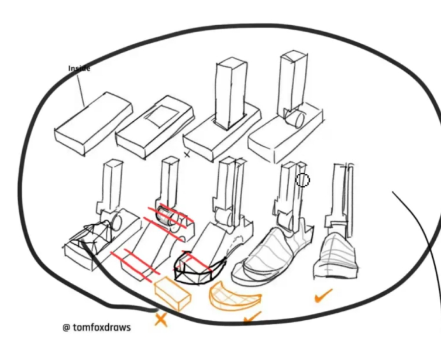

- 今天的目标——
	- 看L03
	- 全力推进L03作业
		- 原谅我无法定出SMART目标
- 今天又被启动阻抗坑了一两个小时！我注意到每天我都会受它影响，浪费一些时间。但……目前对自己要求不要那么高（不然它要闹事了），只要实际克服了它，实际做了推进，就是胜利
- #笔记 Krenz Pers L3
	- 这一课讲了些我感兴趣的东西——主要是**旋转**，自由方块，目测角度等。
	- 旋转其实我有一个很好的解决方案了——圆柱大法。K大的十六格也可用于旋转，而这两个方法实际上都需要**正方形**。正方形即透视圆，透视圆即正方形，它们是可以互相成就的。
	- 我关心的东西——在一个既有的场景中，向其加入自由方块的**方法论**（具体怎么加我心里是有谱的，但我要一个平衡效率和精确度的）。
	- 线条练习方式：首先是练习直线，然后是练习徒手绘制交于特定点（即透视点）的直线
		- 手活儿上：直线练习（用手臂画！）
		- 透视上：交于特定点的直线
		- Level Up：画一个地板（决定两消失点），然后增加厚度得到一个立方体，然后沿着各轴做阵列（每条边都目测）。
	- 讨论旋转时，我们是以一个特定的参考用的方体（或者说XYZ坐标系）出发的。而旋转是对其中的一个轴进行旋转。显然——沿X轴旋转时，另外两个灭点总是在YZ连线上的，其他轴亦然。
	- 自由方块（Krenz称为“高富帅方块”，即画面中的不在地板上的三点透视的物体）**具有非常高的容错率**，它的XYZ只要大概符合整个画面的镜头参数，基本都能骗过人眼（再次地，眼睛真的很好骗）
		- 一般这种物体都不大，因此**都是长焦观感**，如果物体怼到镜头前，那还是得考虑一下畸变了。
	- 能画自由方块，能把抽象形体塞到自由方块里（比如数字2），就能画任意角度的人体了，比如跪坐着的人，坐在扫把上的魔女（都是形状2）
		- **盒子里的事情，就在盒子里面解决**（其实这就是迷之那啥老师所说的结构分析了）
		- （说后面要讲建模（即我所说的硬表面）怎 么练习，mark。
	- 建模的一种练习？手动应用贴图法——打十六宫格，找关键点做映射。
	- #练习方式 **建模的练习，很大程度上就是做对称**——将对称物体手动做透视变换——如扑克的符号，人体的对称等。
	- **褶皱也是通过建模去理解的，火焰、烟雾等特效也是**，即画它们要从空间思维出发。
	- 要把褶皱看成是立体的**硬的物体**（就像手办人物的衣服），绘制这样的褶皱就是把四肢从圆柱体模型修改成实际模型。（当然，这只是其中一种心智模型）
		- 心里想着立体结构，但实际画出来时要概括，简化，要根据构成原则做修改，观感第一
- 身体是思维于外界世界的interface，所以善待它。
- （再次）#注意到 ，其实没有一个所谓的“透视”能力，就像没有一个所谓的“算法”能力，实际存在的，只有解决特定具体模式的问题的能力，比如在算法上，就是解决动态规划问题，图问题，树问题的能力，在绘画的结构分析上，大类分硬表面和有机，再细分就是立方体、圆柱体、圆弧、倒角、人体……各种不正交的分类。
	- 每一个具体的问题，即算法题或者要绘制的对象，都至少涉及上面的一种或多种分类。解决具体问题，并提升对各种类型的问题的理解，
- #mark **有机练习也需要进行细化**，我当前的有机练习（其实也没怎么做）的想法是用圆柱体、立方体做了概括后直接开始画具体形状，但需要意识到，细化也是要分层级的，不要直接从最概括的形状跳到最具体的形状
	- 比如脚，我最初的抽象是一个球（脚踝），一个圆柱体（小腿）和一个立方体（脚板），然后去建立脚趾的曲线，脚背的形状……逐渐去逼近真实的脚（**带轮廓线的**）。
	- 
- 上面也是说硬表面练习和有机练习有各自的发展方向……但这个得在实践中寻找，现在我做再多论述也是空中楼阁。我猜想待我到一定水平后，这两者我可能可以给它统一起来。
-